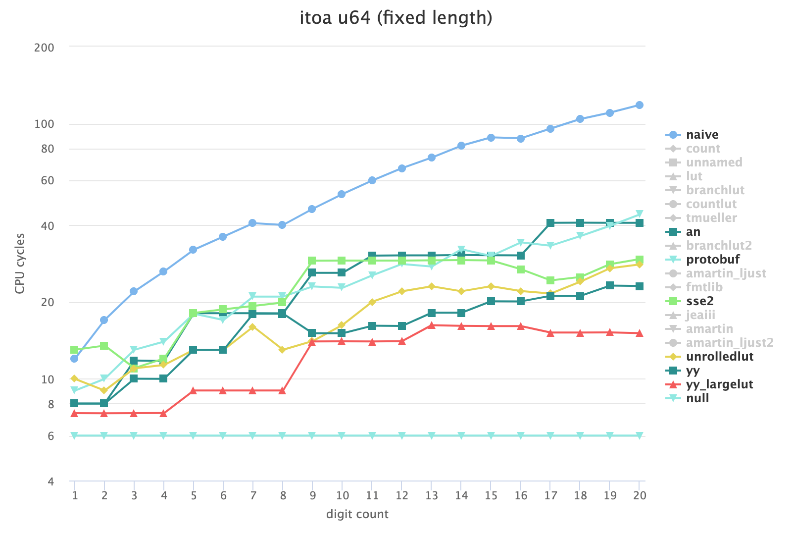
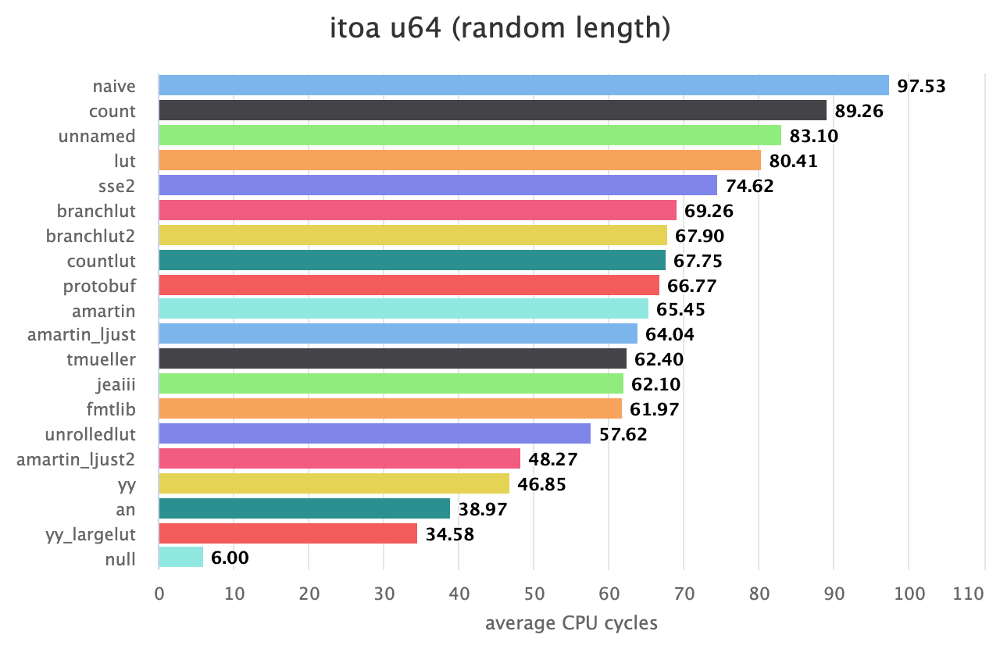
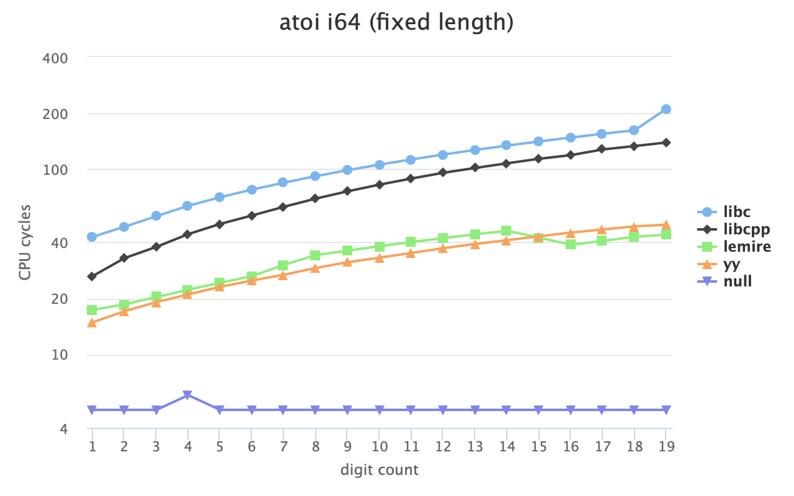
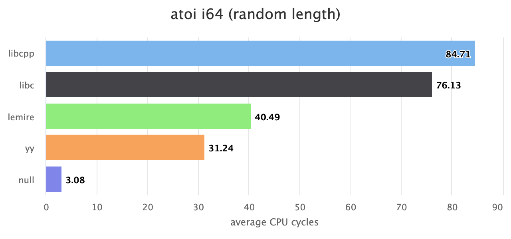
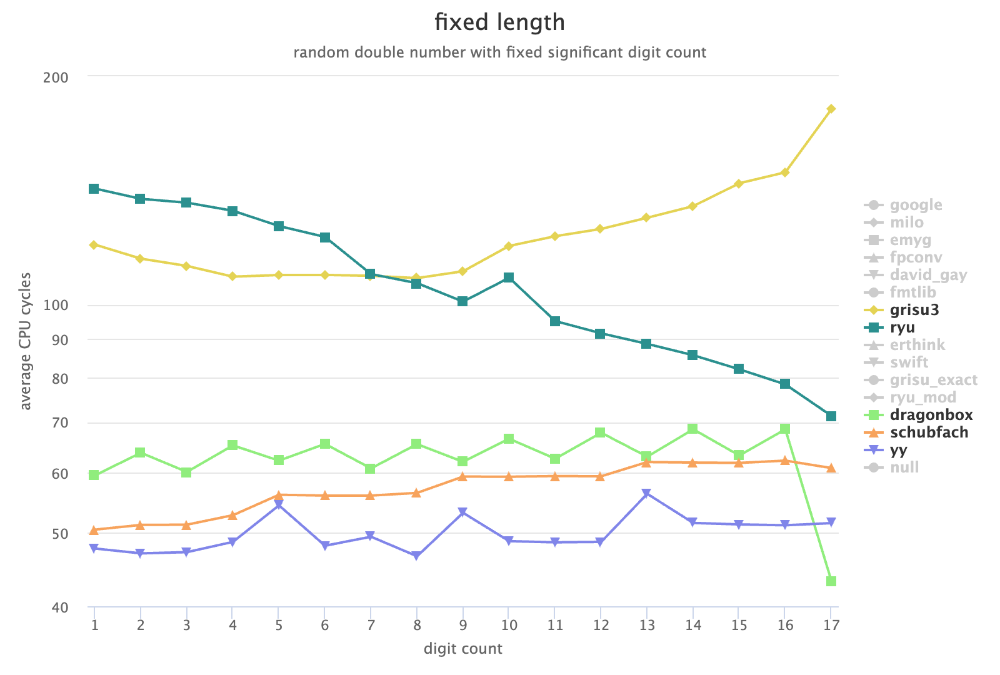
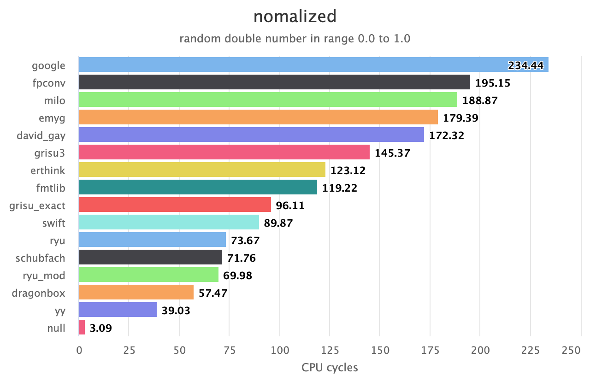
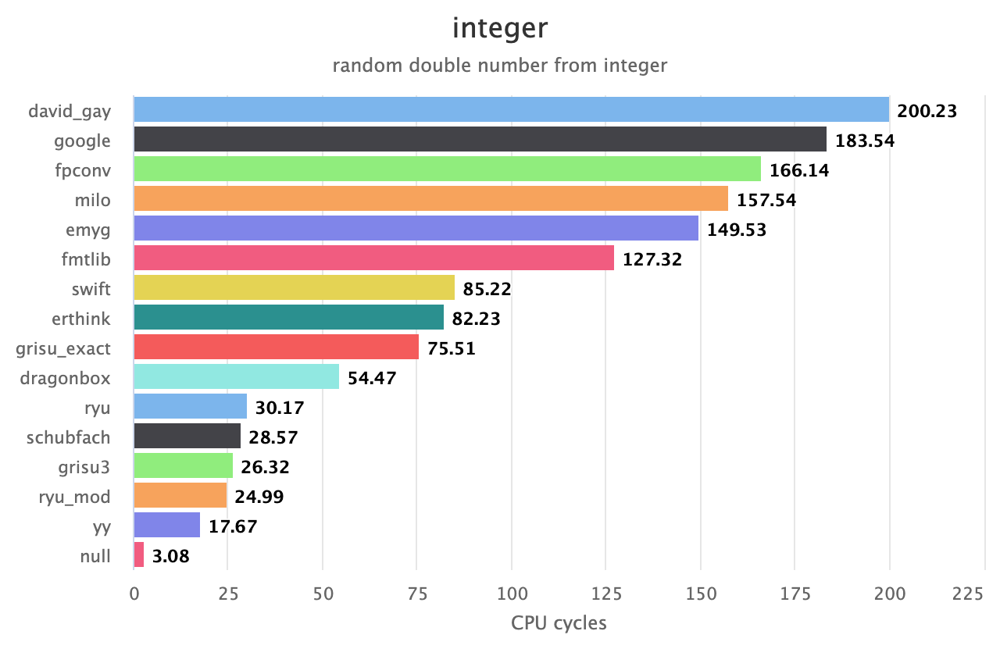
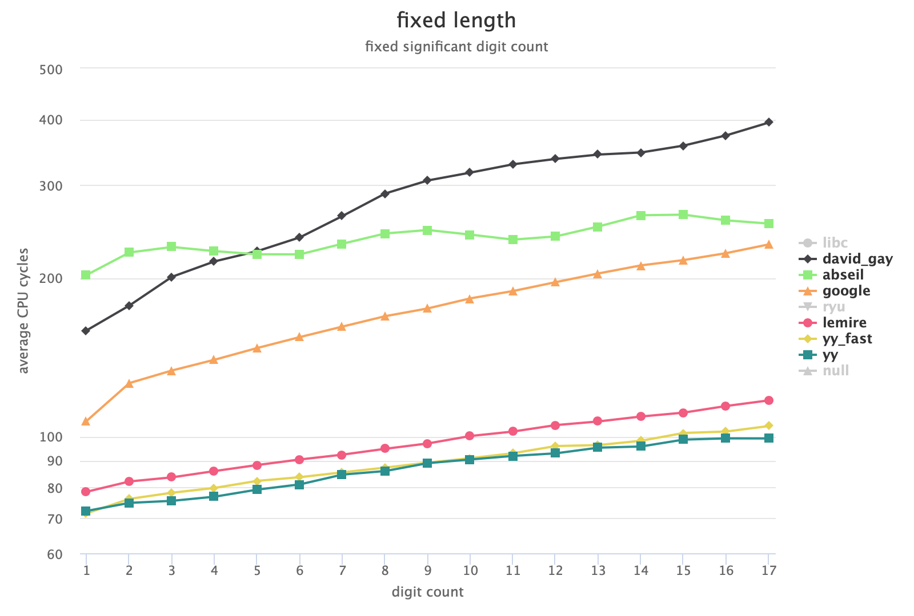
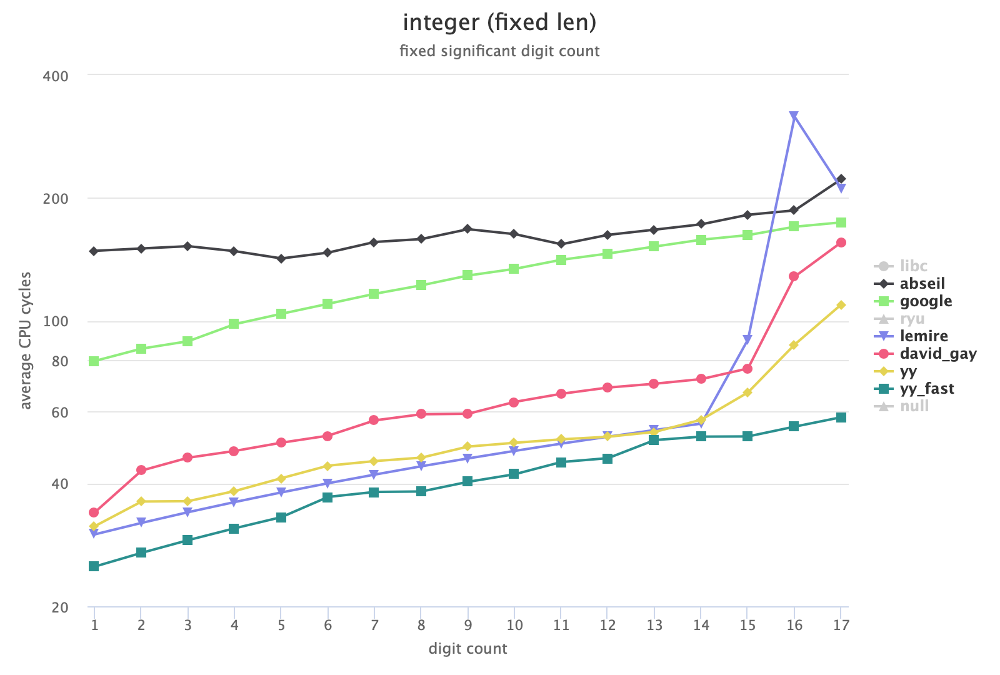

# Number Conversion Benchmark in C
This project evaluates the performance of functions that convert numbers to and from strings in C/C++.

The functions named `yy` is implemented by me, and used in the [yyjson](https://github.com/ibireme/yyjson) library.

# Requirement

- A modern compiler or IDE supporting C11 and C++17.
- CMake 3.14+ for building this project.
- Git for interacting with the submodule in this repository.

# Building

Clone this repository and initialize submodules:
```shell
git clone https://github.com/ibireme/c_numconv_benchmark.git
cd c_numconv_benchmark
git submodule update --init
```

Build and run:
```shell
mkdir build
cd build
cmake ..
cmake --build . --config Release
./run_itoa -o report_itoa.html
./run_atoi -o report_atoi.html
./run_dtoa -o report_dtoa.html
./run_strtod -o report_strtod.html
```

Build with other compiler or IDE:
```shell
# Use arch native:
cmake .. -DARCH_NATIVE=ON

# Clang for Linux/Unix:
cmake .. -DCMAKE_C_COMPILER=clang -DCMAKE_CXX_COMPILER=clang++

# Microsoft Visual Studio for Windows:
cmake .. -G "Visual Studio 16 2019" -A x64
cmake .. -G "Visual Studio 16 2019" -A Win32

# Xcode for macOS:
cmake .. -G Xcode
```

## Make the results more stable and accurate

This benchmark project uses `cpu cycle` for measurement, so `Turbo Boost` and similar technologies should be disabled to make the result more stable and accurate.


# Functions

-------

### Integer to String (itoa)
Function prototype:
```c
char *itoa_u32(uint32_t val, char *buf);
char *itoa_i32(int32_t val, char *buf);
char *itoa_u64(uint64_t val, char *buf);
char *itoa_i64(int64_t val, char *buf);
```



Click these links to see more reports with interactive charts:
* [clang_apple_m1](https://ibireme.github.io/c_numconv_benchmark/reports/clang_apple_m1/itoa.html)
* [clang_intel_i5_13600](https://ibireme.github.io/c_numconv_benchmark/reports/clang_intel_i5_13600/itoa.html)
* [gcc_intel_i5_13600](https://ibireme.github.io/c_numconv_benchmark/reports/gcc_intel_i5_13600/itoa.html)
* [msvc_intel_i5_13600](https://ibireme.github.io/c_numconv_benchmark/reports/msvc_intel_i5_13600/itoa.html)


-------

### String to Integer (atoi)
Function prototype:
```c
// Function prototype:
typedef enum {
    atoi_result_suc = 0,
    atoi_result_fail = 1,
    atoi_result_overflow = 2,
} atoi_result;

uint32_t atoi_u32(const char *str, size_t len, char **endptr, atoi_result *res);
int32_t atoi_i32(const char *str, size_t len, char **endptr, atoi_result *res);
uint64_t atoi_u64(const char *str, size_t len, char **endptr, atoi_result *res);
int64_t atoi_i64(const char *str, size_t len, char **endptr, atoi_result *res);
```




Click these links to see more reports with interactive charts:
* [clang_apple_m1](https://ibireme.github.io/c_numconv_benchmark/reports/clang_apple_m1/atoi.html)
* [clang_intel_i5_13600](https://ibireme.github.io/c_numconv_benchmark/reports/clang_intel_i5_13600/atoi.html)
* [gcc_intel_i5_13600](https://ibireme.github.io/c_numconv_benchmark/reports/gcc_intel_i5_13600/atoi.html)
* [msvc_intel_i5_13600](https://ibireme.github.io/c_numconv_benchmark/reports/msvc_intel_i5_13600/atoi.html)

-------

### Double to String (dtoa)
Function prototype:
```c
// Function prototype:
char *dtoa(double val, char *buf);
```




Click these links to see more reports with interactive charts:
* [clang_apple_m1](https://ibireme.github.io/c_numconv_benchmark/reports/clang_apple_m1/dtoa.html)
* [clang_intel_i5_13600](https://ibireme.github.io/c_numconv_benchmark/reports/clang_intel_i5_13600/dtoa.html)
* [gcc_intel_i5_13600](https://ibireme.github.io/c_numconv_benchmark/reports/gcc_intel_i5_13600/dtoa.html)
* [msvc_intel_i5_13600](https://ibireme.github.io/c_numconv_benchmark/reports/msvc_intel_i5_13600/dtoa.html)

Note: the following functions may not generate shortest decimal representation, or may not remove the trailing zeros in fraction part:
* fpconv
* milo
* emyg
* erthink

-------

### String to Double (strtod)
Function prototype:
```c
// Function prototype:
double strtod(const char *str, size_t len, char **endptr);
```





Click these links to see more reports with interactive charts:
* [clang_apple_m1](https://ibireme.github.io/c_numconv_benchmark/reports/clang_apple_m1/strtod.html)
* [clang_intel_i5_13600](https://ibireme.github.io/c_numconv_benchmark/reports/clang_intel_i5_13600/strtod.html)
* [gcc_intel_i5_13600](https://ibireme.github.io/c_numconv_benchmark/reports/gcc_intel_i5_13600/strtod.html)
* [msvc_intel_i5_13600](https://ibireme.github.io/c_numconv_benchmark/reports/msvc_intel_i5_13600/strtod.html)

Note: 
* `yy_fast` may returns inaccurate result with 0-2 ulp error in some cases.
* `ryu` and `lemire` may reject some integer numbers or large numbers.

-------

# Referenced libraries and articles

**Google (double <-> string)**

Efficient binary-decimal and decimal-binary conversion routines for IEEE doubles.

- <https://github.com/google/double-conversion> (C++ library)

**Swift (double -> string)**

Convert double to string quickly and accurately in SwiftLang.

- <https://github.com/swiftlang/swift/blob/main/stdlib/public/runtime/SwiftDtoa.cpp> (C code)
- <https://github.com/swiftlang/swift/pull/16178> (V1 discussion)
- <https://github.com/swiftlang/swift/pull/35299> (V2 discussion)

**David Gay (double <-> string)**

Widely used ANSI C implementations of strtod and dtoa.

- <http://www.netlib.org/fp/> (C code)

**fmtlib (double -> string, integer -> string)**

A modern formatting library for C++.

- <https://github.com/fmtlib/fmt> (C++ library)
- <https://github.com/fmtlib/format-benchmark> (Benchmark)

**abseil (double <-> string, integer <-> string)**

A C++ Common Libraries.

- <https://github.com/abseil/abseil-cpp> (C++ library)

**ryu (double <-> string)**

Converts floating point numbers to decimal strings.

- <https://github.com/ulfjack/ryu> (C library)
- <https://www.youtube.com/watch?v=kw-U6smcLzk> (Talk)
- <https://dl.acm.org/doi/10.1145/3192366.3192369> (Paper)

**Schubfach (doube -> string)**

The Schubfach way to render doubles by Raffaello Giulietti.
     
- <https://drive.google.com/file/d/1gp5xv4CAa78SVgCeWfGqqI4FfYYYuNFb> (Paper)
- <https://github.com/openjdk/jdk/pull/3402> (Java implementation)
- <https://github.com/abolz/Drachennest> (C++ implementation)

**dragonbox and grisu-exact (double -> string)**

Implementation of Dragonbox in C++.

- <https://github.com/jk-jeon/dragonbox> (C++ library and paper)
- <https://github.com/jk-jeon/Grisu-Exact> (C++ library)

**fast_double_parser (string -> double)**

Fast function to parse strings into double by Daniel Lemire.

- <https://github.com/lemire/fast_double_parser> (C++ library)
- <https://github.com/fastfloat/fast_float> (C++ library)
- <https://www.youtube.com/watch?v=AVXgvlMeIm4> (Talk)
- <https://arxiv.org/abs/2101.11408> (Paper)

**itoa benchmark (integer -> string)**

C++ integer-to-string conversion benchmark
- <https://github.com/miloyip/itoa-benchmark> (Benchmark)

**dtoa benchmark (double -> string)**

C++ double-to-string conversion benchmark

- <https://github.com/miloyip/dtoa-benchmark> (Benchmark)

**AppNexus (integer -> string)**

Print integers faster

- <https://www.reddit.com/r/programming/comments/7ljzty/how_to_print_integers_really_fast_with_source_code/> (Discussion)
- <https://medium.com/xandr-tech/appnexus-common-framework-its-out-also-how-to-print-integers-faster-ceb72ac171a1> (Blog)
- <https://github.com/appnexus/acf/blob/master/src/an_itoa.c> (Code)

**benchmark (string -> integer)**

- <https://medium.com/@julienjorge/benchmarking-atoui-a-follow-up-to-writing-fast-code-90e722590f4d> (Blog)
- <https://github.com/j-jorge/atoi-benchmark> (Benchmark)

**benchmark (double -> string, integer -> string)**

- <https://github.com/miloyip/dtoa-benchmark> (Benchmark)
- <https://github.com/miloyip/itoa-benchmark> (Benchmark)


# License
This project is distributed under the MIT license.

