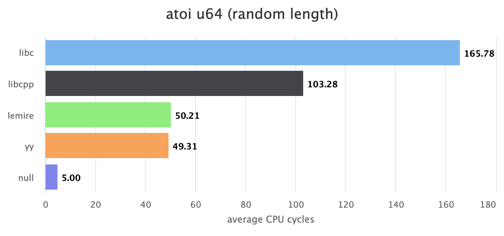
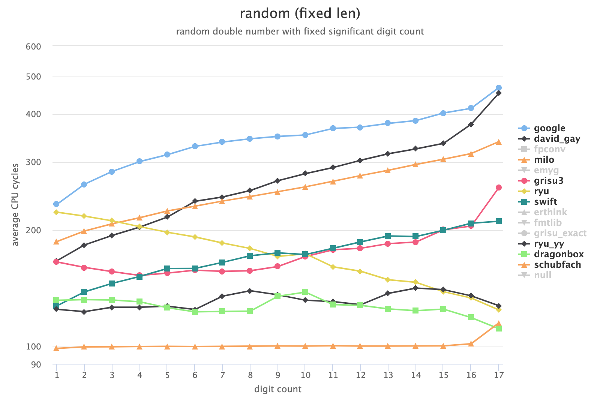
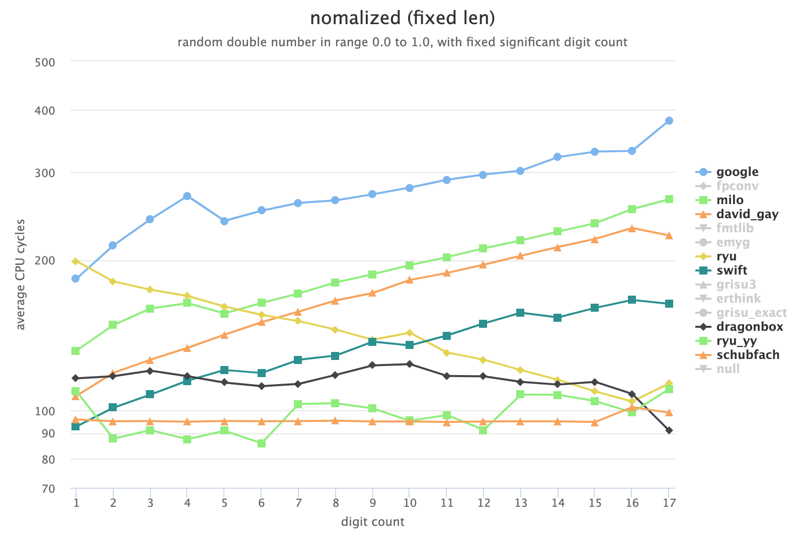
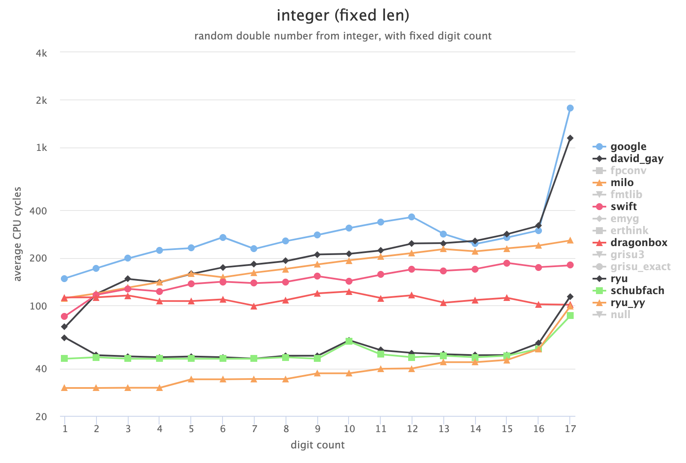
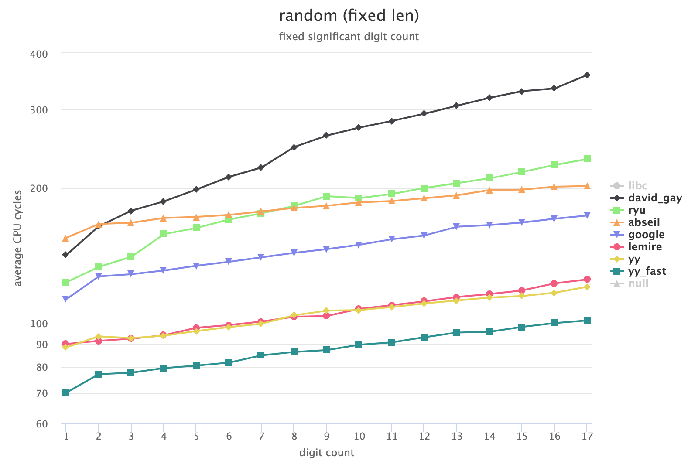
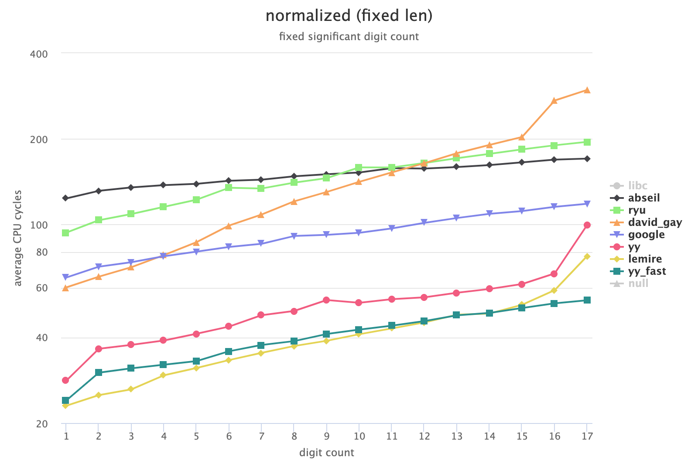

# Number Conversion Benchmark in C
This project evaluates the performance of functions that convert numbers to and from strings in C/C++.

The functions named `yy` is implemented or rewritten by me, and used in the [yyjson](https://github.com/ibireme/yyjson) library.

# Requirement

- A modern compiler or IDE supporting C11 and C++17.
- CMake 3.14+ for building this project.
- Git for interacting with the submodule in this repository.

# Building

Clone this repository and initialize submodules:
```shell
git clone https://github.com/ibireme/c_numconv_benchmark.git
cd c_numconv_benchmark
git submodule update --init
```

Build and run:
```shell
mkdir build
cd build
cmake ..
cmake --build . --config Release
./run_itoa -o report_itoa.html
./run_atoi -o report_atoi.html
./run_dtoa -o report_dtoa.html
./run_strtod -o report_strtod.html
```

If you want to build with other compiler or IDE, try these commands:
```shell
# Clang for Linux/Unix:
cmake .. -DCMAKE_C_COMPILER=clang -DCMAKE_CXX_COMPILER=clang++

# Microsoft Visual Studio for Windows:
cmake .. -G "Visual Studio 16 2019" -A x64
cmake .. -G "Visual Studio 16 2019" -A Win32

# Xcode for macOS:
cmake .. -G Xcode

# Xcode for iOS:
cmake .. -G Xcode -DCMAKE_SYSTEM_NAME=iOS
```

## Make the results more stable and accurate

This benchmark project uses `cpu cycle` for measurement, so `Turbo Boost` and similar technologies should be disabled to make the result more stable and accurate:

- Windows: https://www.tautvidas.com/blog/2011/04/disabling-intel-turbo-boost/
- macOS: http://tbswitcher.rugarciap.com/
- Linux: https://askubuntu.com/a/619881


# Functions

-------

### Integer to String (itoa)
Function prototype:
```c
char *itoa_u32(uint32_t val, char *buf);
char *itoa_i32(int32_t val, char *buf);
char *itoa_u64(uint64_t val, char *buf);
char *itoa_i64(int64_t val, char *buf);
```


Click these links to see more reports with interactive charts:
* [Intel NUC 8i5 clang](https://ibireme.github.io/c_numconv_benchmark/reports/Intel_NUC_8i5_clang_itoa.html)
* [Intel NUC 8i5 gcc](https://ibireme.github.io/c_numconv_benchmark/reports/Intel_NUC_8i5_gcc_itoa.html)
* [Intel NUC 8i5 msvc](https://ibireme.github.io/c_numconv_benchmark/reports/Intel_NUC_8i5_msvc_itoa.html)
* [Apple A12 clang](https://ibireme.github.io/c_numconv_benchmark/reports/Apple_A12_itoa.html)

Note:
* The `yyjson_large_lut` uses a large look-up table, and may not be suitable for common cases.

-------

### String to Integer (atoi)
Function prototype:
```c
// Function prototype:
typedef enum {
    atoi_result_suc = 0,
    atoi_result_fail = 1,
    atoi_result_overflow = 2,
} atoi_result;

uint32_t atoi_u32(const char *str, size_t len, char **endptr, atoi_result *res);
int32_t atoi_i32(const char *str, size_t len, char **endptr, atoi_result *res);
uint64_t atoi_u64(const char *str, size_t len, char **endptr, atoi_result *res);
int64_t atoi_i64(const char *str, size_t len, char **endptr, atoi_result *res);
```




Click these links to see more reports with interactive charts:
* [Intel NUC 8i5 clang](https://ibireme.github.io/c_numconv_benchmark/reports/Intel_NUC_8i5_clang_atoi.html)
* [Intel NUC 8i5 gcc](https://ibireme.github.io/c_numconv_benchmark/reports/Intel_NUC_8i5_gcc_atoi.html)
* [Intel NUC 8i5 msvc](https://ibireme.github.io/c_numconv_benchmark/reports/Intel_NUC_8i5_msvc_atoi.html)
* [Apple A12 clang](https://ibireme.github.io/c_numconv_benchmark/reports/Apple_A12_atoi.html)

-------

### Double to String (dtoa)
Function prototype:
```c
// Function prototype:
char *dtoa(double val, char *buf);
```




Click these links to see more reports with interactive charts:
* [Intel NUC 8i5 clang](https://ibireme.github.io/c_numconv_benchmark/reports/Intel_NUC_8i5_clang_dtoa.html)
* [Intel NUC 8i5 gcc](https://ibireme.github.io/c_numconv_benchmark/reports/Intel_NUC_8i5_gcc_dtoa.html)
* [Intel NUC 8i5 msvc](https://ibireme.github.io/c_numconv_benchmark/reports/Intel_NUC_8i5_msvc_dtoa.html)
* [Apple A12 clang](https://ibireme.github.io/c_numconv_benchmark/reports/Apple_A12_dtoa.html)

Note: the following functions may not generate shortest decimal representation, or may not remove the trailing zeros in fraction part:
* fpconv
* milo
* emyg
* schubfach
* erthink

-------

### String to Double (strtod)
Function prototype:
```c
// Function prototype:
double strtod(const char *str, size_t len, char **endptr);
```




Click these links to see more reports with interactive charts:
* [Intel NUC 8i5 clang](https://ibireme.github.io/c_numconv_benchmark/reports/Intel_NUC_8i5_clang_strtod.html)
* [Intel NUC 8i5 gcc](https://ibireme.github.io/c_numconv_benchmark/reports/Intel_NUC_8i5_gcc_strtod.html)
* [Intel NUC 8i5 msvc](https://ibireme.github.io/c_numconv_benchmark/reports/Intel_NUC_8i5_msvc_strtod.html)
* [Apple A12 clang](https://ibireme.github.io/c_numconv_benchmark/reports/Apple_A12_strtod.html)

Note: `yy_fast` may returns inaccurate result with 0-2 ulp error in some cases.

-------

# Referenced libraries and articles

**google (double<->string)**

Efficient binary-decimal and decimal-binary conversion routines for IEEE doubles
<https://github.com/google/double-conversion>

**Swift (double->string)**

Convert double to string quickly and accurately
<https://github.com/apple/swift/blob/master/stdlib/public/runtime/SwiftDtoa.cpp>
<https://github.com/apple/swift/pull/16178>

**David Gay (double<->string)**

ANSI C source for functions strtod and dtoa
<http://www.netlib.org/fp/>

**fmtlib (double->string, integer->string)**

A modern formatting library for C++
<https://github.com/fmtlib/fmt>
<https://github.com/fmtlib/format-benchmark>
<https://github.com/fmtlib/fmt/pull/1882>

**abseil (double<->string, integer<->string)**

A C++ Common Libraries
<https://github.com/abseil/abseil-cpp>

**ryu (double<->string)**

Converts floating point numbers to decimal strings
<https://github.com/ulfjack/ryu>

**dragonbox and grisu-exact (double->string)**

Implementation of Dragonbox in C++
<https://www.reddit.com/r/cpp/comments/ishdj9/updates_in_dragonbox/>
<https://github.com/jk-jeon/dragonbox>
<https://github.com/jk-jeon/Grisu-Exact>
<https://github.com/jk-jeon/dtoa-benchmark>

**fast_double_parser (string->double)**

Fast function to parse strings into double by lemire
<https://github.com/lemire/fast_double_parser>

**itoa benchmark (integer->string)**

C++ integer-to-string conversion benchmark
<https://github.com/miloyip/itoa-benchmark>

**dtoa benchmark (double->string)**

C++ double-to-string conversion benchmark
<https://github.com/miloyip/dtoa-benchmark>

**AppNexus (integer->string)**

Print integers faster
<https://www.reddit.com/r/programming/comments/7ljzty/how_to_print_integers_really_fast_with_source_code/>
<https://medium.com/xandr-tech/appnexus-common-framework-its-out-also-how-to-print-integers-faster-ceb72ac171a1>
<https://github.com/appnexus/acf/blob/master/src/an_itoa.c>

**benchmark (string->integer)**

<https://medium.com/@julienjorge/benchmarking-atoui-a-follow-up-to-writing-fast-code-90e722590f4d>
<https://github.com/j-jorge/atoi-benchmark>

**benchmark (double->string, integer->string)**
<https://github.com/miloyip/dtoa-benchmark>
<https://github.com/miloyip/itoa-benchmark>


# License
This project is distributed under the MIT license.

